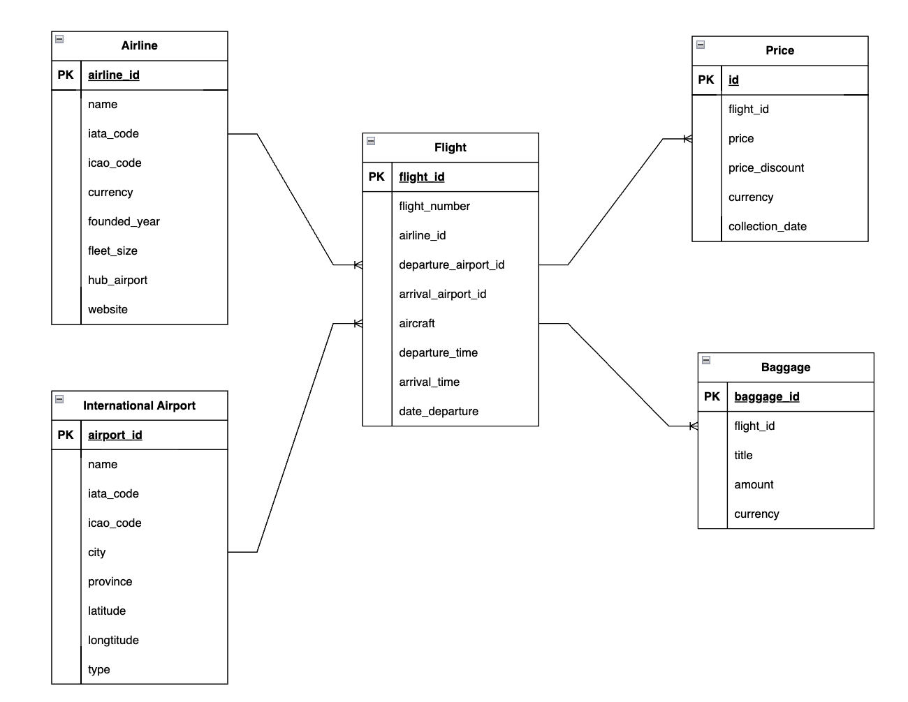

# K33-Data-Engineering-Domestic-Airfare-Analysis

## Project Overview
- Objective: To analyze domestic airfare trends by gathering data from travel sources and providing insights into price fluctuations, seasonal patterns and demand.
- Data Source: [**Traveloka**](https://www.traveloka.com/) - a popular platform for travel booking in the region.

## Tools & Technologies
- Data Lake - [**Google Cloud Storage**](https://cloud.google.com/storage)
- Orchestration - [**Airflow**](https://airflow.apache.org/)
- Data Warehouse - [**PostgreSQL**](https://www.postgresql.org/)
- Data Visualization - [**Superset**](https://superset.apache.org/)
- Language - [**Python**](https://www.python.org)

## Architecture

## Data Schema

## Setup

### Setup Project in Google Cloud

- Create a Google Cloud Project: This will be the parent environment for managing resources. Go to the [**Google Cloud Console**](https://console.cloud.google.com/) and create a new project.
- Enable Required APIs:
    Go to the API & Services section and enable the following:  
        - Compute Engine API (for VMs)  
        - Cloud Storage API (for storage)